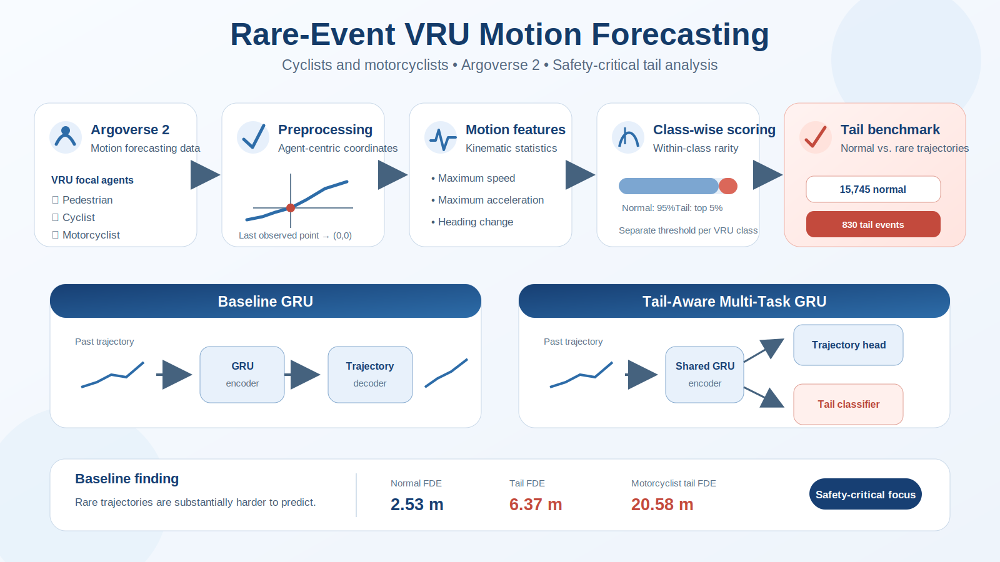

# Rare-Event VRU Motion Forecasting

> **A research prototype for forecasting pedestrian, cyclist, and motorcyclist trajectories, with explicit evaluation of rare and safety-critical motion patterns.**

[](https://www.python.org/)
[](https://pytorch.org/)
[](https://www.argoverse.org/av2.html)
[](#project-status)

<p align="center">
  
</p>

## At a glance

**Research question**

> Can a forecasting model improve performance on statistically rare VRU trajectories without sacrificing accuracy on normal motion?

**What is implemented**

- Argoverse 2 pedestrian, cyclist, and motorcyclist extraction.
- Agent-centric trajectory normalization.
- Class-wise rare-event labeling from motion statistics.
- Constant-velocity and constant-acceleration baselines.
- A GRU trajectory predictor.
- A multi-task GRU with an auxiliary tail-event classifier.
- Separate evaluation of normal and tail subsets.
- Failure analysis of naive rare-event oversampling.

**Current central finding**

The baseline GRU reaches **2.5283 m FDE on normal trajectories** and **6.3666 m FDE on tail trajectories**. Rare trajectories are therefore substantially harder, while the first tail-aware experiment shows that naive balanced oversampling can produce negative transfer rather than improve tail forecasting.

```text
Argoverse 2 VRU trajectories
            ↓
Agent-centric preprocessing
            ↓
Class-wise rare-event labeling
            ↓
Kinematic and GRU forecasting
            ↓
Normal-versus-tail evaluation
            ↓
Tail-aware model diagnosis
```

---

## Research objective

Most forecasting models are optimized for average performance. This can hide poor behavior on the low-frequency trajectories that matter most in safety-critical driving scenarios, including abrupt turns, sudden acceleration, sharp braking, unusual lateral motion, and aggressive cyclist or motorcyclist maneuvers.

This project studies **rare-event tail forecasting for vulnerable road users (VRUs)**. Its objective is not only to reduce global Average Displacement Error (ADE) and Final Displacement Error (FDE), but also to measure and improve performance on difficult tail cases separately.

The repository should be interpreted as a controlled research prototype for studying this problem, not as a production autonomous-driving forecasting system.

---

## Main contributions

1. **VRU-specific Argoverse 2 pipeline** for pedestrians, cyclists, and motorcyclists.
2. **Agent-centric preprocessing** that removes global translation and orientation.
3. **Class-wise statistical tail labeling**, avoiding a single threshold across road-user classes with different natural dynamics.
4. **Normal-versus-tail evaluation** using ADE and FDE.
5. **Per-class tail analysis**, exposing the particularly high errors observed for cyclist and motorcyclist tail subsets.
6. **Tail-aware multi-task GRU**, combining trajectory forecasting with auxiliary rare-event classification.
7. **Negative-result analysis**, showing that naive balanced oversampling can degrade both normal and tail forecasting.
8. **Explicit methodological limitations**, including the need to derive validation labels from training statistics only.

---

## Why tail-aware evaluation?

Average ADE and FDE are dominated by frequent and relatively predictable trajectories. A model can therefore achieve good average performance while failing badly on rare behavior.

Cyclists and motorcyclists are especially important because they:

- exhibit more variable dynamics than pedestrians;
- can accelerate and change direction rapidly;
- are underrepresented in many public datasets;
- are highly exposed in collisions;
- may perform uncommon but safety-critical maneuvers near intersections.

A safety-oriented forecasting study should therefore report both average accuracy and tail-subset accuracy.

---

## Dataset

The project uses the **Argoverse 2 Motion Forecasting Dataset**.

Each trajectory contains:

- **50 observed steps**: 5 seconds of motion history;
- **60 future steps**: 6 seconds to predict;
- sampling frequency: **10 Hz**.

Only focal agents belonging to the following classes are retained:

- `pedestrian`
- `cyclist`
- `motorcyclist`

### VRU subset statistics

| Split | Pedestrian | Cyclist | Motorcyclist | Total |
|---|---:|---:|---:|---:|
| Train | 12,845 | 2,692 | 1,038 | **16,575** |
| Validation | 1,572 | 303 | 134 | **2,009** |

The distribution is strongly imbalanced, with pedestrians representing most available trajectories.

> The Argoverse 2 dataset is **not included** in this repository. Users must download it separately and follow the official Argoverse licensing terms.

---

## Trajectory preprocessing

Raw global coordinates are converted to an agent-centric frame.

For every trajectory:

1. the last observed position is translated to the origin;
2. all positions are expressed relative to that point;
3. the trajectory is rotated so that the latest observed heading aligns with the positive x-axis.

The resulting tensors are:

```text
past:   (50, 2)
future: (60, 2)
```

This reduces irrelevant variation caused by absolute map position and global orientation.

---

## Tail-event definition

A **tail event** is defined here as a statistically rare motion pattern within the same road-user class.

For each trajectory, the pipeline computes:

- mean and maximum speed;
- mean and maximum acceleration;
- mean and maximum heading change;
- total displacement.

The preliminary score is:

```text
tail_score = 0.4 × normalized_max_speed
           + 0.4 × normalized_max_acceleration
           + 0.2 × normalized_max_heading_change
```

The top 5% of trajectories are labeled as tail events.

### Why class-wise labeling?

A global threshold is biased because the natural dynamics of each class differ. A normal motorcyclist is typically faster than a normal pedestrian. Under one shared threshold, many ordinary motorcyclist trajectories can be incorrectly classified as rare.

The current approach therefore normalizes features and applies the 95th-percentile threshold **separately for each class**.

### Class-wise training labels

| Class | Normal | Tail | Tail rate |
|---|---:|---:|---:|
| Pedestrian | 12,202 | 643 | 5.01% |
| Cyclist | 2,557 | 135 | 5.01% |
| Motorcyclist | 986 | 52 | 5.01% |
| **Total** | **15,745** | **830** | **5.01%** |

### Validation labels

| Class | Normal | Tail |
|---|---:|---:|
| Pedestrian | 1,493 | 79 |
| Cyclist | 287 | 16 |
| Motorcyclist | 127 | 7 |
| **Total** | **1,907** | **102** |

> **Important methodological limitation:** the current prototype computed validation scaling and thresholds independently on the validation split. Publication-quality evaluation must estimate normalization parameters and tail thresholds from the training split only, then apply them unchanged to validation and test data.

---

## Models

### 1. Kinematic baselines

- **Constant Velocity**
- **Constant Acceleration**

### 2. GRU trajectory baseline

The baseline neural predictor uses:

- a 2-layer GRU encoder;
- hidden dimension: 128;
- a fully connected decoder;
- output: 60 future 2D positions.

### 3. Tail-Aware Multi-Task GRU

The tail-aware model uses one shared GRU encoder and two heads:

```text
Observed trajectory
        │
        ▼
   Shared GRU encoder
      ┌───────┴────────┐
      ▼                ▼
Trajectory head   Tail classifier
  60 × 2 points    normal / tail
```

The training objective is:

```text
L = L_trajectory + λ L_tail
```

The auxiliary classifier is intended to encourage the shared representation to encode motion patterns associated with difficult trajectories.

---

## Evaluation protocol

### Forecasting metrics

**Average Displacement Error**

```text
ADE = mean Euclidean distance between predicted and ground-truth future positions
```

**Final Displacement Error**

```text
FDE = Euclidean distance at the final prediction step
```

Results are reported for:

- all validation trajectories;
- normal trajectories;
- tail trajectories;
- each VRU class separately.

### Tail classification metrics

The auxiliary classifier is evaluated using:

- precision;
- recall;
- F1-score;
- confusion matrix.

Accuracy alone is not considered sufficient because tail events represent only about 5% of the data.

---

## Current experimental results

### Kinematic baselines

| Model | ADE (m) | FDE (m) |
|---|---:|---:|
| Constant Velocity | 4.4022 | 11.6556 |
| Constant Acceleration | 9.5523 | 28.5941 |

### GRU baseline

| Subset | ADE (m) | FDE (m) | Samples |
|---|---:|---:|---:|
| Overall | **1.2353** | **2.7232** | 2,009 |
| Normal | **1.1569** | **2.5283** | 1,907 |
| Tail | **2.7004** | **6.3666** | 102 |

Tail trajectories have approximately **2.5× larger FDE** than normal trajectories.

### Baseline results by class

| Class | Overall ADE | Overall FDE | Tail ADE | Tail FDE | Tail samples |
|---|---:|---:|---:|---:|---:|
| Pedestrian | 0.8838 | 1.8366 | 1.9552 | 4.3950 | 79 |
| Cyclist | 1.9071 | 4.2605 | 4.1668 | 9.8823 | 16 |
| Motorcyclist | 3.8395 | 9.6487 | 7.7591 | 20.5818 | 7 |

The motorcyclist tail subset is the most difficult, although seven tail samples are too few to support a strong statistical conclusion.

### Tail-Aware GRU v1

The first multi-task experiment used balanced sampling, changing the effective training distribution from approximately 95/5 to 50/50.

| Subset | ADE (m) | FDE (m) |
|---|---:|---:|
| Overall | 1.6131 | 3.5613 |
| Normal | 1.5318 | 3.3698 |
| Tail | 3.1325 | 7.1427 |

Tail classification:

| Metric | Value |
|---|---:|
| Accuracy | 0.8870 |
| Precision | 0.1981 |
| Recall | 0.4020 |
| F1-score | 0.2654 |

```text
TP = 41
TN = 1741
FP = 166
FN = 61
```

The v1 model did **not** improve forecasting. Oversampling the limited tail set likely distorted the trajectory-learning distribution and produced negative transfer.

### Tail-Aware GRU v2 status

The revised experiment:

- removes balanced sampling;
- preserves the original data distribution;
- uses weighted binary cross-entropy for the auxiliary classifier;
- reduces the auxiliary loss weight to `λ = 0.05`;
- selects checkpoints based on trajectory loss.

Best observed training trajectory loss:

```text
3.1569
```

Validation evaluation for v2 is still pending. The training loss alone is not presented as evidence of improved forecasting.

---

## Preliminary findings

1. **A global tail threshold is biased across VRU classes.** Class-wise labeling is more appropriate because pedestrians, cyclists, and motorcyclists have different natural motion distributions.
2. **Rare trajectories are substantially harder to predict.** The baseline GRU reaches 2.5283 m normal FDE versus 6.3666 m tail FDE.
3. **Naive oversampling can degrade both average and tail performance.** Tail awareness cannot be introduced simply by repeating rare samples until the training set appears balanced.
4. **Tail conclusions require uncertainty estimates.** The cyclist and motorcyclist tail subsets are small, so confidence intervals and repeated-seed experiments are necessary before making stronger claims.

These are preliminary simulation and dataset-based findings, not final publication claims.

---

## Repository structure

```text
rare-event-vru-motion-forecasting/
├── assets/
│   └── rare_event_vru_pipeline.svg
├── models/
│   ├── gru.py
│   └── tail_gru.py
├── scripts/
│   ├── create_classwise_tail_labels.py
│   ├── evaluate_tail_gru.py
│   ├── evaluate_tail_gru_v2.py
│   ├── train_tail_gru.py
│   └── train_tail_gru_v2.py
├── src/
│   ├── dataset.py
│   └── tail_dataset.py
├── outputs/
├── requirements.txt
├── .gitignore
└── README.md
```

Model checkpoints, generated CSV files, and the Argoverse 2 dataset should not be committed.

---

## Installation

```bash
git clone https://github.com/panagiotagrosdouli/rare-event-vru-motion-forecasting.git
cd rare-event-vru-motion-forecasting
python3 -m venv venv
source venv/bin/activate
pip install -r requirements.txt
```

Main dependencies:

```text
torch
numpy
pandas
pyarrow
```

---

## Running the experiments

Create class-wise tail labels:

```bash
PYTHONPATH=. python scripts/create_classwise_tail_labels.py --split train
PYTHONPATH=. python scripts/create_classwise_tail_labels.py --split val
```

Train the first tail-aware model:

```bash
PYTHONPATH=. python scripts/train_tail_gru.py
```

Train the revised tail-aware model:

```bash
PYTHONPATH=. python scripts/train_tail_gru_v2.py
```

Evaluate a trained model:

```bash
PYTHONPATH=. python scripts/evaluate_tail_gru.py
```

Paths may need to be adjusted according to the local Argoverse 2 directory structure.

---

## Methodological limitations

1. Validation tail statistics are currently estimated from the validation split itself rather than frozen from training data.
2. The weighted tail score and its coefficients are preliminary design choices.
3. Tail labels represent statistical rarity, not human-reviewed semantic danger.
4. The current predictor is deterministic and unimodal.
5. Map context, social interaction, traffic signals, and sensor inputs are not modeled.
6. Results have not yet been repeated across multiple random seeds.
7. Cyclist and motorcyclist tail sample counts are small.
8. Stronger modern motion-forecasting baselines have not yet been included.

These limitations separate what the current experiments demonstrate from the intended research direction.

---

## Research roadmap

- [x] Extract VRU focal-agent trajectories from Argoverse 2
- [x] Implement agent-centric trajectory normalization
- [x] Build constant-velocity and constant-acceleration baselines
- [x] Train a GRU forecasting baseline
- [x] Create class-wise statistical tail labels
- [x] Evaluate normal and tail subsets independently
- [x] Implement a multi-task tail-aware GRU
- [x] Diagnose failure caused by balanced oversampling
- [ ] Evaluate Tail-Aware GRU v2 on validation data
- [ ] Fit tail thresholds on training data only
- [ ] Add confidence intervals and repeated-seed experiments
- [ ] Perform ablation studies on tail features and loss weighting
- [ ] Add qualitative trajectory visualizations
- [ ] Investigate human-reviewed tail-event annotation
- [ ] Compare against stronger motion-forecasting baselines
- [ ] Add uncertainty-aware or multimodal prediction

---

## Long-term research direction

The long-term goal is to build a curated rare-event benchmark for cyclists and motorcyclists and develop forecasting methods that improve safety-critical tail performance without sacrificing normal-case accuracy.

A motivating case is a motorcycle approaching an intersection and suddenly overtaking a stopped or slowing vehicle. A model optimized only for the average trajectory may continue the motorcycle along its previous path, while a tail-aware or multimodal model should represent the possibility of rapid lateral motion.

Potential extensions include:

- uncertainty-aware and multimodal forecasting;
- class-conditioned tail definitions;
- distributionally robust optimization;
- hard-example mining;
- focal or ranking-based objectives;
- human annotation of semantic maneuver types;
- evaluation on additional datasets.

---

## Project status

This repository is a **research prototype and work in progress**.

The reported numbers are useful for experimentation and diagnosis, but the benchmark is not yet publication-ready. In particular:

- validation tail thresholds must be derived from training statistics only;
- results should be repeated across multiple random seeds;
- the small number of motorcyclist tail samples requires careful interpretation;
- the current weighted tail score is a preliminary design choice;
- stronger baselines and qualitative analysis are still required.

---

## Acknowledgements

This project uses the Argoverse 2 Motion Forecasting Dataset. Please cite the official Argoverse 2 publications when using the dataset in academic work.

---

## Author

**Panagiota Grosdouli**

Research interests: autonomous driving, vulnerable road-user trajectory forecasting, intelligent transportation systems, and safety-critical machine learning.
